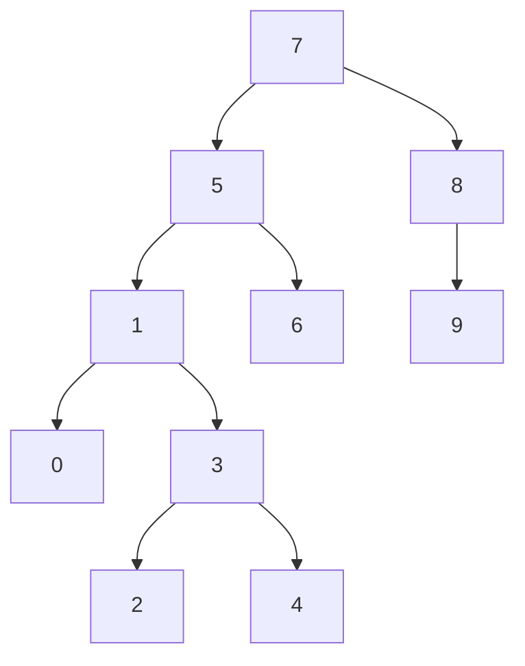

# [7,5,1,8,3,6,0,9,4,2] -> Binary tree search

### Time complexity değeri O(n)’dir.

 

[Alparslan KELCİ](https://github.com/AlparslanKelci "My github repository")

 

* Created with Markdown syntax & Mermaid Graphs